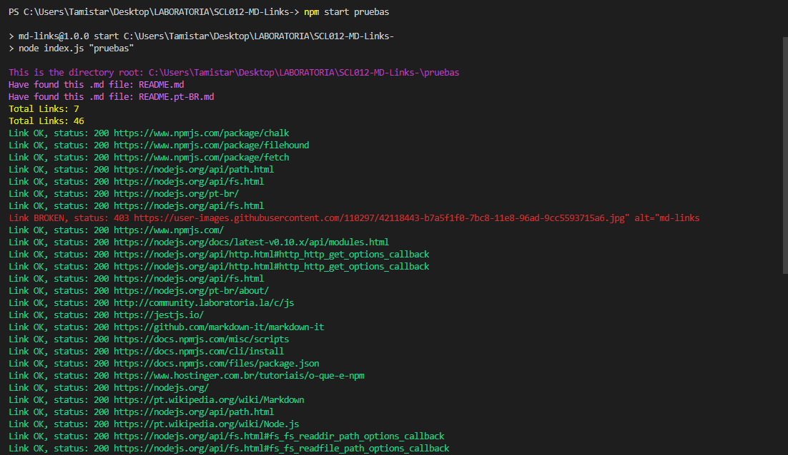
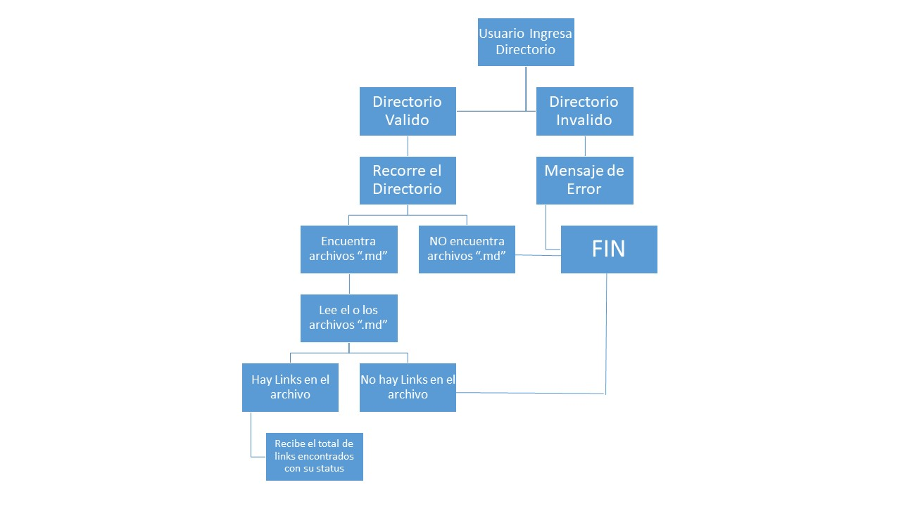

# Md-Links

## Descripción
MD-Links es una librería implementada en Javascript y ejecutada en Node.js, que sirve para leer y analizar archivos en formato Markdown comunmente conocidos como "md". Con esta librería podremos verificar las url del documento, reportar algunas estadísticas, ya sea la cantidad de links y el estado de estos mismos.

## Instalación ⚙

Para instalar la librería debes correr el siguiente comando:
```
    npm install tamaramunoz/SCL012-MD-Links-
```

### Pre-requisitos

Para el correcto funcionamiento, debes tener instalado [Node.js](https://nodejs.org/), y otras librearías complementarias:


-  [Path](https://nodejs.org/api/path.html)
-  [File System](https://nodejs.org/api/fs.html)
-  [Fetch](https://www.npmjs.com/package/fetch)
-  [FileHound](https://www.npmjs.com/package/filehound)
-  [Markdown-it](https://github.com/markdown-it/markdown-it)
-  [Chalk](https://www.npmjs.com/package/chalk)

## ¿Cómo ejecutar la librería?

Ingresa el siguiente comando en la terminal
```
    npm start <nombre-del-directorio>
```
La librería te enviará la siguiente información: 
- Ruta del directorio.
- Nombre del archivo .md
- Total de links encontrados en el archivo.
- Lista de archivos con su url y status.



## Diagrama de flujo


## Próximas Mejoras
- Que la librería pueda envíar la información según *--validate* y *--stats*.
- Que pueda entregar la información de los archivos por separado.
- Que pueda entregar una estadistica más completa el total de los links *uniques* y *broken*.

## Desarrolladora 💻
**Tamara Muñoz**